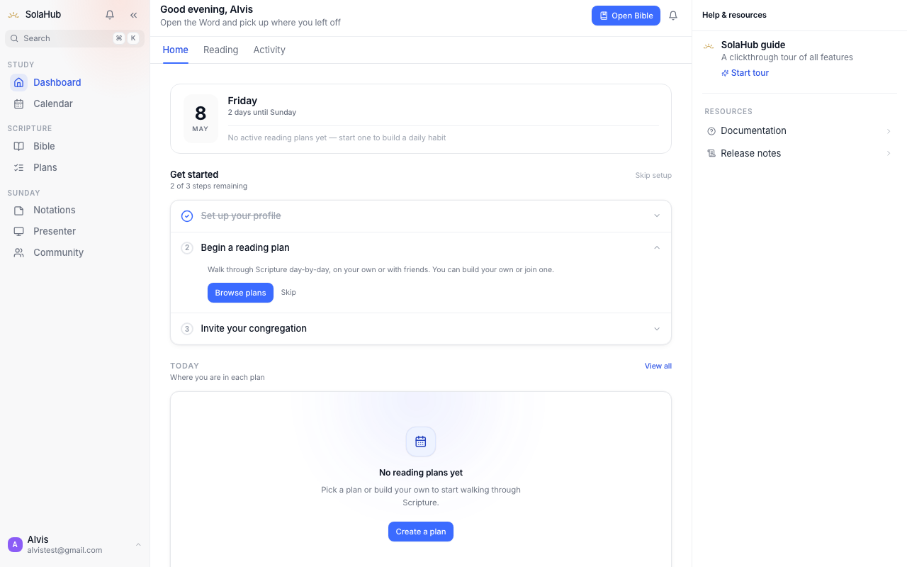
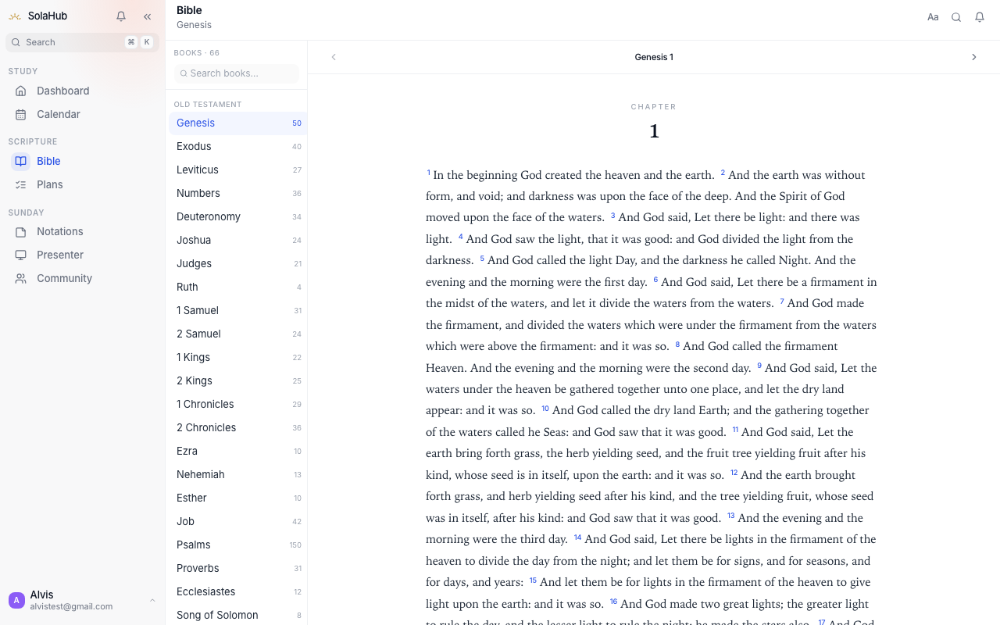
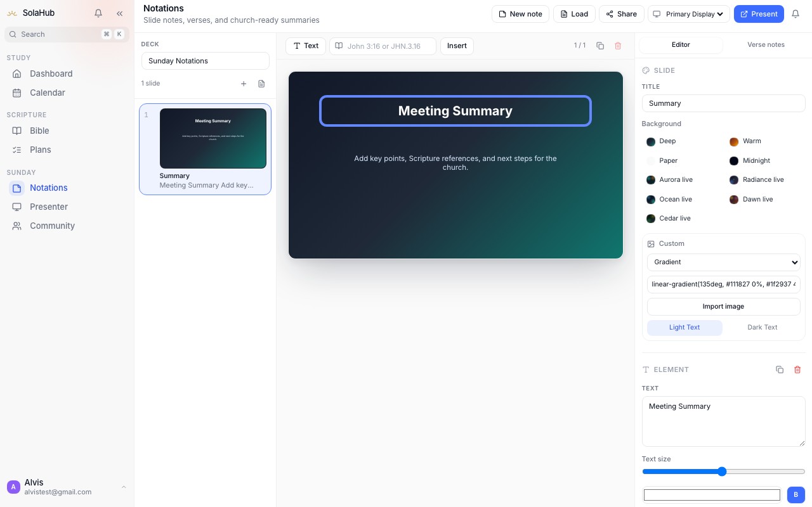
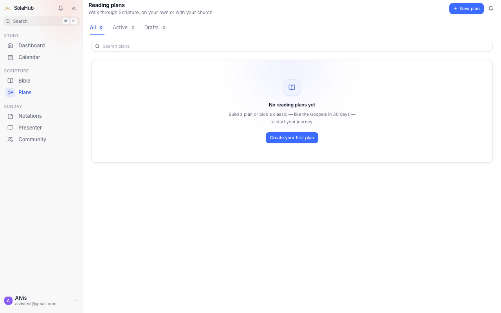
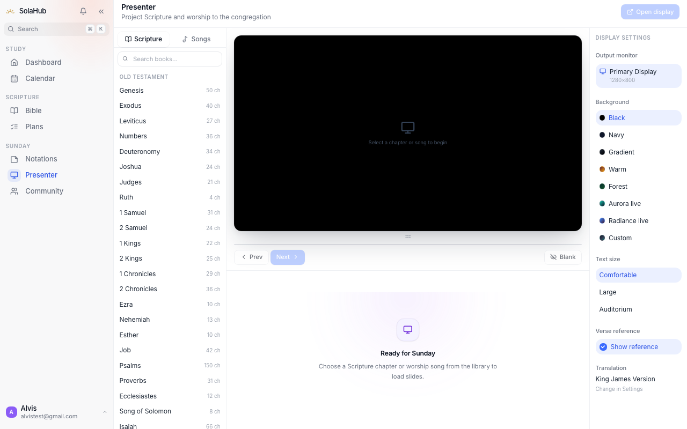
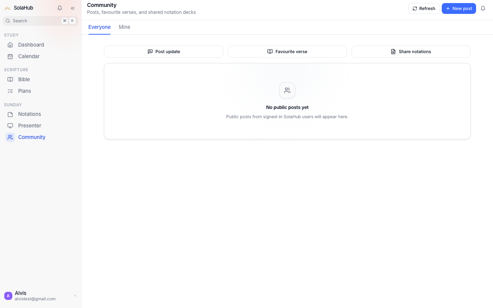
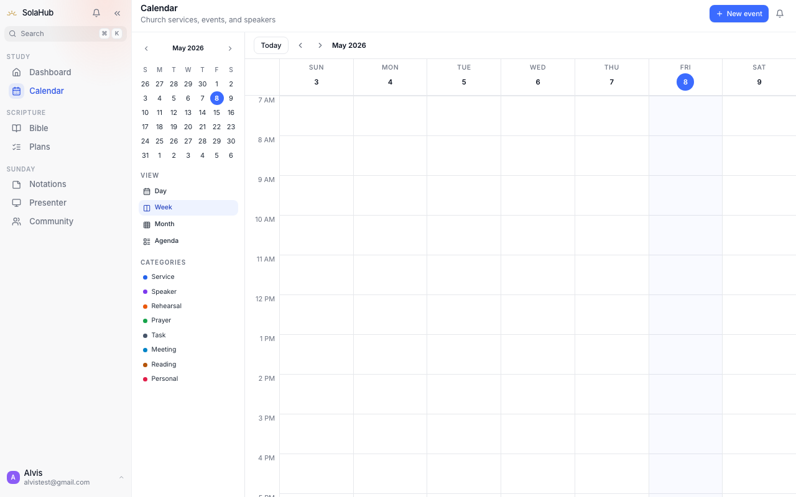
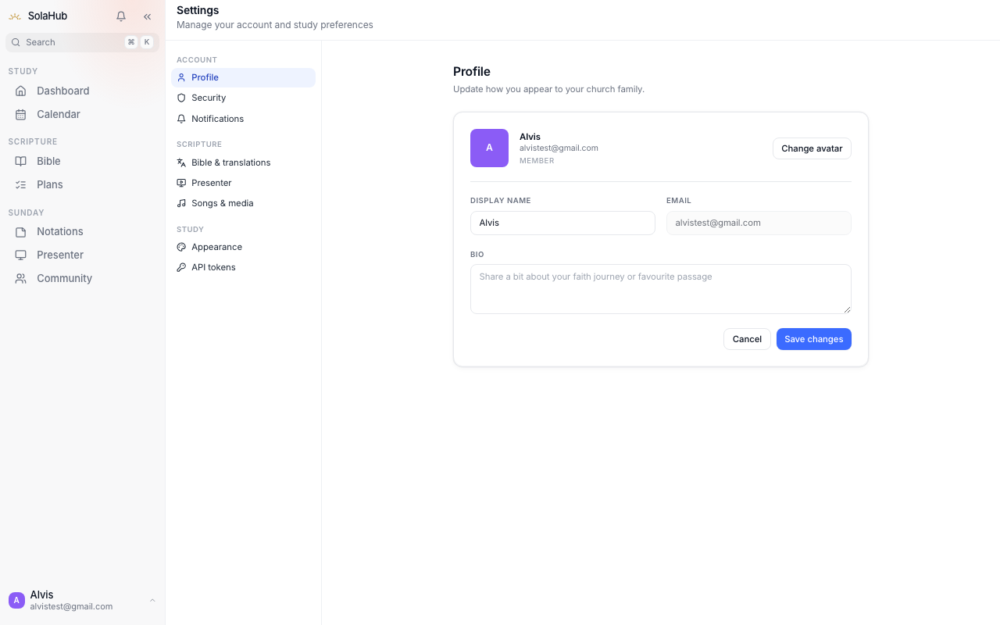
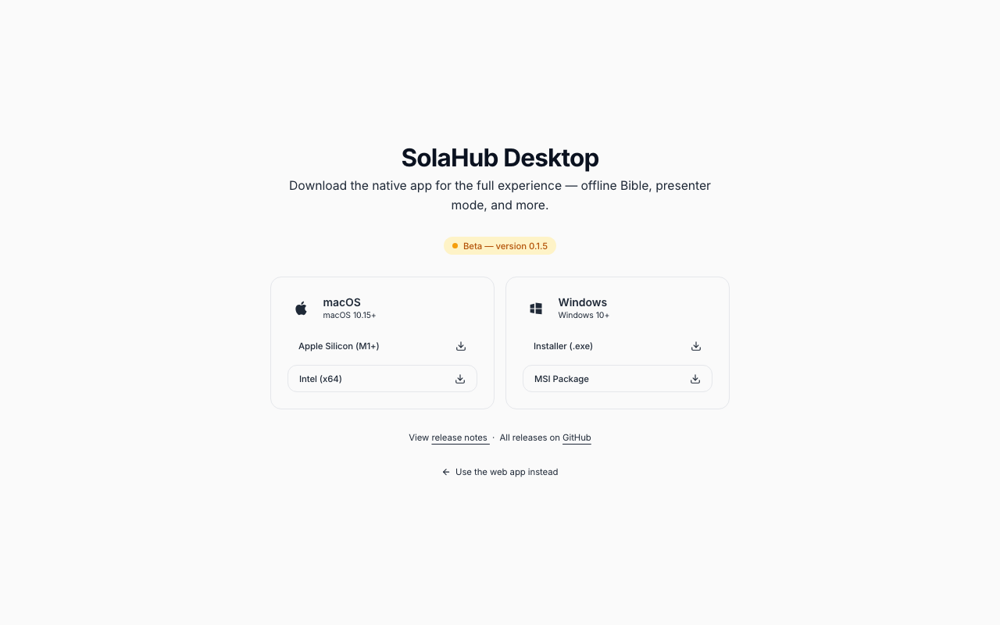

# SolaHub

A desktop app built for churches and Christians who want everything in one place — Bible reading, verse notes, reading plans, worship presentation, and church collaboration, without bouncing between five different tools.

> **License:** Source available. You can read and learn from this code, but commercial use and redistribution are not permitted without permission. See [LICENSE](./LICENSE) for full terms.

---

## What it is

SolaHub is a native desktop application (Windows and macOS) that brings together the tools a church member or worship leader actually uses week to week. The Bible reader lets you annotate verses inline and highlight passages as you go. Reading plans are shareable so a small group can follow the same schedule. The presenter mode lets you push Bible verses and song lyrics to a second display during a service, live, without fuss. Everything syncs to your account so it follows you across devices.

It's built with Tauri so it actually feels like a real desktop app — no Electron memory bloat, native window chrome, proper system integration.

---

## Screenshots


### Dashboard

The home screen greets you by name and shows where you are in your reading week. The onboarding checklist helps new users get set up fast — it disappears once you're done. The right rail surfaces help docs, release notes, and quick links. No clutter, just the things you actually need to see.

---

### Bible Reader

Full Scripture reading experience with every book and chapter available offline. The left panel lets you jump to any book instantly. Verses are laid out cleanly for sustained reading — no ads, no distractions. You can tap any verse to annotate it, and the translation can be switched from the top bar.

---

### Notations (Slide-based Notes)

Notations are more than plain text notes — they're presentation-ready slides you build around Scripture. Write content in the editor, attach verse references, choose a background theme (including live animated options like Aurora and Radiance), then send slides straight to the presenter. Good for sermon prep, Sunday school, or small group teaching.

---

### Reading Plans

Create structured reading plans with day-by-day verse assignments, or browse community plans. Plans can be kept private or published so your church can follow along together. The Active tab tracks how far you've come; the Drafts tab holds plans you're still building.

---

### Presenter Mode

The presenter is what makes SolaHub genuinely useful on a Sunday morning. Pick a Scripture chapter or song from the left panel, and it renders verse-by-verse slides in the preview. Hit "Open display" and the slides go fullscreen on your projector or second screen — no video-switching, no cable fuss. Background, text size, and translation are all adjustable on the right.

---

### Community

Post updates, share a favourite verse, or publish a notation deck to your church community. The feed surfaces content from everyone in your congregation. "Mine" tab filters to just your own posts.

---

### Calendar

Church calendar with day, week, month, and agenda views. Events are colour-coded by category — services, speakers, rehearsals, prayer meetings, and more. The mini calendar on the left makes it fast to jump to any week.

---

### Settings

Settings cover your profile, security, notifications, Bible translation preferences, presenter defaults, song & media library, appearance, and API tokens — all in one place, neatly divided into sections.

---

### Download Page

The in-app download page for the native desktop build. Separate packages for Apple Silicon, Intel Mac, and Windows (installer or MSI). Links to release notes and the full GitHub releases list.

---

## Features

**Bible**
- Full Bible reader with book/chapter navigation and verse search
- Inline verse highlighting and annotations
- Multiple translation support (KJV and others)
- Quick verse lookup from anywhere in the app

**Presenter**
- Push verses or song lyrics to a second monitor live
- Customizable slide backgrounds and font sizes
- Song library with multi-language support
- No cables, no switching apps mid-service

**Notes**
- Attach notes to any verse reference
- Tag system for organising by topic or sermon series
- Notes are searchable and sortable

**Reading Plans**
- Create custom plans with day-by-day verse assignments
- Publish plans to share with your church or small group
- Track progress per day with completion logging

**Community**
- Church member directory and group joining
- Real-time collaboration features via SignalR
- Shared reading plans across a church

**Dashboard**
- Activity feed showing recent notes, plan progress, and updates
- Quick-access widgets for today's reading and recent annotations
- Greeting and daily overview

---

## Tech stack

| Layer | Technology |
|-------|-----------|
| Desktop shell | Tauri 2.0 (Rust) |
| Frontend | Vue 3.5, TypeScript, Vite, Tailwind CSS |
| Backend API | ASP.NET Core (.NET 10), C# |
| Database | PostgreSQL 16 (EF Core 10, Row Level Security) |
| Auth | JWT (HMAC-SHA256) + BCrypt + refresh token rotation |
| Real-time | SignalR (CollaborationHub) |
| Architecture | Clean Architecture + CQRS (MediatR), Result monad |
| Testing | xUnit + FluentAssertions + Testcontainers (integration), Vitest (unit), Playwright (e2e) |
| CI/CD | GitHub Actions → Railway |

---

## Getting started

### Prerequisites

- Node.js 22+
- .NET 10 SDK
- Rust (stable toolchain)
- PostgreSQL 16
- Docker (optional, for local database via `docker-compose`)

### Local setup

**1. Clone the repo**

```bash
git clone https://github.com/alvslovescyber/SolaHub.git
cd SolaHub
```

**2. Set up the frontend**

```bash
npm install
cp .env.example .env
# Edit .env and set VITE_API_URL to your local API address
```

**3. Set up the backend**

```bash
# Copy the example config and fill in your local values
cp api/src/SolaHub.API/appsettings.Development.json.example \
   api/src/SolaHub.API/appsettings.Development.json
# Edit appsettings.Development.json with your PostgreSQL credentials and JWT secret
```

**4. Start the local database**

```bash
docker-compose up -d
```

**5. Run database migrations**

```bash
cd api
dotnet ef database update --project src/SolaHub.Infrastructure --startup-project src/SolaHub.API
```

**6. Run everything**

```bash
# In one terminal — start the API
cd api && dotnet run --project src/SolaHub.API

# In another terminal — start the Tauri dev app
npm run tauri dev
```

The app window will open automatically. The API runs on `http://localhost:5000` by default.

---

## Running tests

```bash
# Frontend unit tests
npm run test:run

# Backend unit tests
dotnet test api/tests/SolaHub.Tests.Unit

# Backend integration tests (requires a running PostgreSQL)
# Set the connection string via environment variable
ConnectionStrings__DefaultConnection="Host=localhost;..." \
  dotnet test api/tests/SolaHub.Tests.Integration

# End-to-end tests
npm run test:e2e
```

---

## Project structure

```
SolaHub/
├── src/                        # Vue 3 frontend
│   ├── views/                  # Page-level components
│   ├── components/s/           # Shared design system components (S-prefixed)
│   ├── stores/                 # Pinia stores
│   ├── services/               # API and Tauri service wrappers
│   ├── composables/            # Reusable Vue composition functions
│   └── types/                  # TypeScript type definitions
├── src-tauri/                  # Rust Tauri shell
│   ├── src/                    # Tauri commands and SQLite integration
│   └── resources/              # Bundled assets (offline Bible database)
├── api/
│   └── src/
│       ├── SolaHub.Core/       # Domain entities and value objects
│       ├── SolaHub.Application/# CQRS commands/queries, validators
│       ├── SolaHub.Infrastructure/ # EF Core, repositories, SignalR hub
│       └── SolaHub.API/        # ASP.NET Core controllers, middleware
├── e2e/                        # Playwright end-to-end tests
├── .github/workflows/          # CI/CD pipelines
└── docker-compose.yml          # Local development database
```

---

## Environment variables

The frontend reads from `.env` (copy `.env.example` to get started):

| Variable | Description |
|----------|-------------|
| `VITE_API_URL` | Base URL for the backend API |

The backend reads from `appsettings.Development.json` locally (copy `.json.example`). Required keys:

| Key | Description |
|-----|-------------|
| `ConnectionStrings:DefaultConnection` | PostgreSQL connection string |
| `Jwt:SecretKey` | HMAC-SHA256 signing key (32+ bytes) |
| `Jwt:Issuer` | Token issuer (e.g. `SolaHub`) |
| `Jwt:Audience` | Token audience (e.g. `SolaHub.Desktop`) |

---

## Contributing

Pull requests for bug fixes, performance improvements, and accessibility improvements are welcome. If you want to add a major feature, open an issue first so we can talk through the design before you invest the time.

A few things to keep in mind:

- Run `npm run verify` before pushing frontend changes
- Run `npm run verify:api` before pushing backend changes
- The backend uses CSharpier for formatting — it'll fail CI if not applied
- Integration tests run against a real PostgreSQL instance, not mocks

---

## License

SolaHub is source-available. You're free to read, learn from, and run it locally for personal use. Redistribution, commercial use, and derivative products are not permitted without explicit written permission. See [LICENSE](./LICENSE) for full details.

© 2026 SolaHub. All rights reserved.
